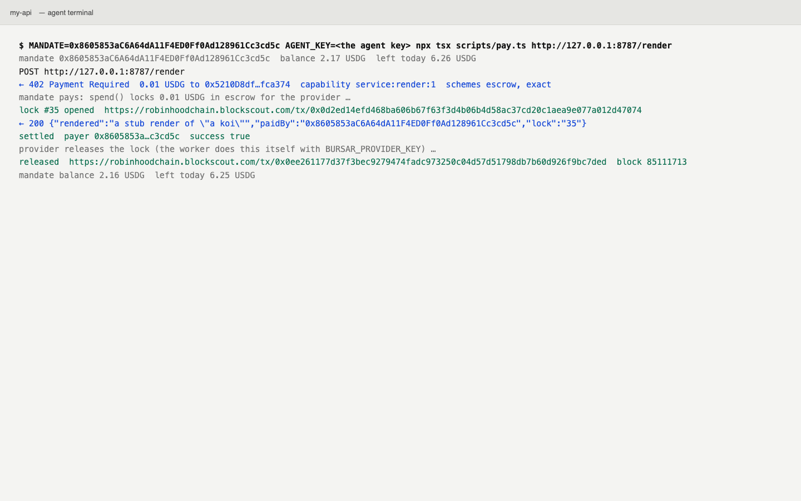

# Cloudflare provider

**Any Cloudflare Worker charges agents through Bursar, one command to deploy.**

A Worker wraps its fetch handler in `withBursar`, names a price per route, and deploys with
`wrangler`. An agent that calls a priced route without paying gets a 402 with the price in USDG on
Robinhood Chain. One that pays from its Bursar mandate gets the result, the payment lands in escrow
for the provider, and the mandate's limits hold on chain. The first paid calls ran on 2026-10-10 for
0.01 USDG each, against the Worker running under `wrangler dev` on this Mac.

Cloudflare is named as the hosting the Worker runs on. There is no partnership, listing or
endorsement, and the copy says none.

## What is live and what is prepared

Live on the branch, tests green:

- `packages/provider-worker`, published as `@bursar/provider-worker` once the operator runs the
  publish step. `withBursar(handler)` answers 402 with the offer (both x402 versions), verifies a
  presented payment with the facilitator, serves the route, settles, reports the settlement in the
  response headers, and with the provider's key as a secret releases the escrow lock after the
  response is sent. Configuration is by environment: `BURSAR_PROVIDER`, `BURSAR_CAPABILITY`,
  `BURSAR_PRICES`, `BURSAR_FACILITATOR_URL`, `BURSAR_FACILITATOR_TOKEN`, `BURSAR_PROVIDER_KEY`,
  `BURSAR_RPC_URL`, `BURSAR_SCHEMES`. Sixteen tests run the bundled worker on `workerd` through
  Miniflare with the facilitator and the chain standing in, including the release transaction
  decoded back to `release(lockId, keccak256(served bytes), '')` on the lock's escrow.
- `templates/cloudflare-worker`: a wrangler project with one priced route, `POST /render` at
  0.01 USDG, a README, and `scripts/pay.ts`, the agent side, which pays the Worker once from a
  mandate with `@bursar/sdk`.
- `packages/create-provider`, published as `@bursar/create-provider`: `npm create @bursar/provider
  my-api` (or `npx @bursar/create-provider my-api`) copies the template, names the Worker after the
  directory and prints the next commands. Its build copies the template in and pins the published
  versions.
- The console: a "Charge from a Cloudflare Worker" card on the Developers page under Charging
  agents, on the provider desk for a connected provider, and on the providers page for a visitor.
  `apps/web` typechecks, its tests pass, and `next build` completes.

Prepared, waiting on the operator:

- Publishing the two packages to npm.
- Deploying the demo Worker to the Cloudflare account. The token in `~/.config/bursar/cloudflare.env`
  reads and writes DNS on the `bursar.world` zone only: uploading a script answered "No access to the
  specified resource" and the Workers subdomain read answered "Authentication error", both tested
  against the API on 2026-10-10. The demo therefore ran under `wrangler dev`, paid for real.

## The demo

Two real payments from the live example mandate `0x8605853aC6A64dA11F4ED0Ff0Ad128961Cc3cd5c` to the
demo provider `0x5210D8df060A9D5ce4c1305045ED5c9548fca374`, through the hosted facilitator, each
0.01 USDG, each released by the provider:

| Step | Transaction |
|---|---|
| The principal allows `service:render:1` on the example mandate | [`0x370cb271…9412c9`](https://robinhoodchain.blockscout.com/tx/0x370cb271ff08ddcbe9de250837ff1fc26a269c5c4f40b859f221edd37d9412c9) |
| Lock 32 opened by the mandate's `spend` for the first paid call | [`0x47930b5c…31bf40`](https://robinhoodchain.blockscout.com/tx/0x47930b5ce9111a0c7cc8746afabb97aed93d8ada93fd93deafaacad4f431bf40) |
| Lock 32 released by the provider, block 85109401 | [`0x4b038d25…1a34c4`](https://robinhoodchain.blockscout.com/tx/0x4b038d25583ecc2201c9baac1b43b9ea8d2dddce3f4f2d6051afdaf9ef1a34c4) |
| Lock 35 opened for the filmed call | [`0x0d2ed14e…d47074`](https://robinhoodchain.blockscout.com/tx/0x0d2ed14efd468ba606b67f63f3d4b06b4d58ac37cd20c1aea9e077a012d47074) |
| Lock 35 released, block 85111713 | [`0x0ee26117…bc7ded`](https://robinhoodchain.blockscout.com/tx/0x0ee261177d37f3bec9279474fadc973250c04d57d51798db7b60d926f9bc7ded) |

The facilitator's `/verify` read each lock and answered valid with the mandate as payer; `/settle`
recorded each once and broadcast nothing, which is how the escrow scheme settles. The mandate's
balance and its daily window each moved by exactly 0.01 per call (2.434620 to 2.424620 USDG on the
first; 2.17 to 2.16 on the filmed one, other demos having spent from the same mandate in between).
The provider received 0.0099 USDG per call after the escrow's fee. Spend for the build: 0.02 USDG and
about 0.00003 ETH in fees, inside the limits.

Both locks show on the public desk at
<https://app.bursar.world/providers/0x5210D8df060A9D5ce4c1305045ED5c9548fca374> as paid.

### Running it

The Worker, locally:

```
cd templates/cloudflare-worker
printf 'BURSAR_FACILITATOR_TOKEN=%s\n' "$FACILITATOR_AUTH_TOKEN" > .dev.vars
npx wrangler dev
curl -i -X POST http://127.0.0.1:8787/render -H 'content-type: application/json' -d '{"prompt":"a koi"}'
```

The agent, from a mandate whose principal allows the capability:

```
MANDATE=0x… AGENT_KEY=0x… npx tsx scripts/pay.ts http://127.0.0.1:8787/render
```

The proof above used the keystore wrapper in the ops checkout, which pays the same way and then
releases the lock with the payee key, the sidecar's job when the Worker runs without one:
`cd ~/Projects/bursar-ops/ops/e2e && npx tsx src/cloudflare-pay.ts http://127.0.0.1:8787/render`.
The film came from `npx tsx film/cloudflare-film.ts <url> <out dir>` in the same place.

## What the operator must do

1. **Publish the packages**, with the npm token on the ops Mac:
   ```
   pnpm --filter "@bursar/provider-worker..." build && pnpm --filter @bursar/provider-worker test
   cd packages/provider-worker && pnpm publish --access public --no-git-checks
   cd ../create-provider && pnpm build && pnpm publish --access public --no-git-checks
   ```
   `create-provider`'s `prepack` copies the template in and pins `@bursar/provider-worker` to the
   version just published. Publish the worker package first.
2. **Deploy the demo Worker.** Create a Cloudflare API token with Workers Scripts: Edit on the
   account (`c84ce11d1231d37151f0c11619349a14`, the one that owns `bursar.world`), then:
   ```
   export CLOUDFLARE_API_TOKEN=…
   cd templates/cloudflare-worker
   npx wrangler secret put BURSAR_FACILITATOR_TOKEN     # the hosted facilitator's provider token
   npx wrangler deploy
   ```
   The URL is `https://bursar-provider.<account subdomain>.workers.dev`. The first deploy on an
   account may ask to register the subdomain. Optionally `npx wrangler secret put
   BURSAR_PROVIDER_KEY` with the payee key, so the Worker releases each lock itself, and keep a
   little ETH at the payee address for fees. For a custom route such as `api.bursar.world`, add a
   Workers Route on the zone; the DNS token already covers the record.
3. **Pay it once**, so the announcement links a call against the public URL:
   `npx tsx src/cloudflare-pay.ts https://bursar-provider.<subdomain>.workers.dev/render` from
   `~/Projects/bursar-ops/ops/e2e`, and add the two transactions to this doc.
4. **Push the branch and open the pull request** from
   <https://github.com/bursar-world/bursar/compare/main...bullish/cloudflare-provider>.
5. **Facilitator tokens.** The hosted facilitator answers providers that hold the one provider
   token. A third party who deploys this needs one; decide whether to hand out the shared token, run
   a token per provider, or open `/verify` and `/settle` to the public.

No governance action: the registry entry and the capability were already in place or sent from
the demo keys.

## Honest limits

- No Worker is deployed yet. The demo ran on this Mac under `wrangler dev`, which is the same
  runtime, paid for real on mainnet. The deployed URL arrives with the operator's step 2.
- The hosted facilitator requires a bearer token on `/verify` and `/settle`. Until that changes, a
  stranger who deploys the template cannot settle without asking for a token.
- Releasing the lock is what pays the provider. In the Worker that needs the provider's key as a
  Workers secret; the demo kept the key out of Cloudflare and released from the ops script instead,
  which is also what the sidecar does. Release fees are ETH from the provider's address.
- Prices are a static table per method and path. A price that depends on the request body is not
  supported.
- To commit to what it served, the Worker reads the response body in full before releasing, so a
  large or streaming response is buffered once.
- A settle the facilitator does not answer is reported to the agent as `settlement_unconfirmed`,
  and the agent's SDK treats that as a failed payment. On the escrow scheme nothing was broadcast
  at settle, so a retry opens a second lock; the first returns at its deadline.
- The two packages are not on npm until step 1. `npm create @bursar/provider` and the console copy
  describe that state as current, so publish before the announcement.
- The payee's record on the desk counts these calls as "paid, still contestable" for the dispute
  window and "not yet recorded" after it; recording is a separate call anyone can make.

## Links

- Package: <https://github.com/bursar-world/bursar/blob/bullish/cloudflare-provider/packages/provider-worker/README.md>
  (`packages/provider-worker/src/middleware.ts` is the handler)
- Scaffolder: <https://github.com/bursar-world/bursar/blob/bullish/cloudflare-provider/packages/create-provider/src/cli.ts>
- Template: <https://github.com/bursar-world/bursar/blob/bullish/cloudflare-provider/templates/cloudflare-worker/README.md>
- Console copy: <https://github.com/bursar-world/bursar/blob/bullish/cloudflare-provider/apps/web/src/components/worker-quickstart.tsx>
- Branch diff: <https://github.com/bursar-world/bursar/compare/main...bullish/cloudflare-provider>
- Pull request: to be opened from the diff above by the operator.
- npm: `@bursar/provider-worker`, `@bursar/create-provider` (after the publish step)
- Worker URL: `https://bursar-provider.<account subdomain>.workers.dev` (after the deploy step)
- Provider desk: <https://app.bursar.world/providers/0x5210D8df060A9D5ce4c1305045ED5c9548fca374>
- Transactions: the five in the table above, on robinhoodchain.blockscout.com

## Screenshots and recording

Under `docs/bullish/cloudflare-provider/`, 1440×900, no keys in frame:

- `01-deploy.png`: `wrangler deploy` (dry run, no account), `wrangler dev` ready, and the Worker
  answering 402 to an unpaid `curl`.
- `02-402.png`: the agent's terminal reading the 402: 0.01 USDG, the provider, the capability, the
  two schemes.
- `03-paid.png`: the mandate pays, lock 35 opens, the Worker answers 200, the settlement reports
  the payer, the provider releases, the mandate's balance and window move by 0.01.
- `04-desk.png`: the provider desk listing locks 35 and 32 as paid.
- `05-receipt.png`: the release transaction on the explorer.
- `demo.webm`: 34 seconds, the filmed call from 402 to release, then the desk and the receipt.



A Cloudflare Worker can now charge agents for a route. Install `@bursar/provider-worker`, wrap the
fetch handler, put a price on the route in `wrangler.toml` and deploy. An agent that calls the route
without paying gets a 402 with the price in USDG. One that pays from its Bursar mandate gets the
result, the payment lands in escrow for the provider on Robinhood Chain, and the mandate's limits
hold on chain. The first paid calls ran today at $0.01 each, lock, settlement and release on the
chain. `npm create @bursar/provider my-api` writes the whole project.

## Announcement

**One line.** Any Cloudflare Worker can now charge AI agents per call through Bursar: add one
package, set a price, deploy with wrangler.

**One paragraph.** A Cloudflare Worker can now charge agents for a route. Install
`@bursar/provider-worker`, wrap the fetch handler, put a price on the route in `wrangler.toml` and
deploy. An agent that calls the route without paying gets a 402 with the price in USDG. One that
pays from its Bursar mandate gets the result, the payment lands in escrow for the provider on
Robinhood Chain, and the mandate's limits hold on chain. The first paid calls ran today at $0.01
each, lock, settlement and release on the chain. `npm create @bursar/provider my-api` writes the
whole project.

**One post.**

Charge agents from a Cloudflare Worker.

Workers are where a lot of small APIs live. From today one of them can take payment from an AI
agent per call, settled through Bursar on Robinhood Chain.

```
npm create @bursar/provider my-api
cd my-api && npm install
npx wrangler secret put BURSAR_FACILITATOR_TOKEN
npx wrangler deploy
```

That gives you a Worker with one priced route, `POST /render` at 0.01 USDG. Set your provider
address, the capability and the prices in `wrangler.toml`. An existing Worker takes the same
route: install `@bursar/provider-worker`, wrap the fetch handler in `withBursar`, and price routes
with `BURSAR_PRICES`. Routes without a price pass through as before.

What an agent sees: a 402 with the price, payable from its mandate. The mandate pays by locking
the amount in escrow for you, inside the limits its principal set, and the call goes through. You
are paid when the lock is released, which the Worker does itself once it holds your key.

Today's first calls: an agent paid 0.01 USDG for a render, the Worker answered, the payment
settled and the provider released. Lock, settlement and release are on the chain:
robinhoodchain.blockscout.com/tx/0x0d2ed14efd468ba606b67f63f3d4b06b4d58ac37cd20c1aea9e077a012d47074.

Docs and the template: app.bursar.world/docs.

## Progress

- 15:20 UTC. Read the rules, the x402 package, the facilitator's escrow lane and the mainnet proof.
  Tested the Cloudflare token against the API: DNS only; Workers upload refused. Decided to build
  the Worker library self-contained on `@bursar/core` and `viem`, test on `workerd` through
  Miniflare, and run the demo under `wrangler dev`.
- 16:35 UTC. Library written and built. Sixteen tests on `workerd` green, including the decoded
  release transaction. Bundle 463 KB, 136 KB compressed.
- 17:40 UTC. Template under `wrangler dev` answered 402; first real payment from the example
  mandate settled through the hosted facilitator and the provider released lock 32. Scaffolder and
  its tests green. First commit.
- 17:45 UTC. Console copy on the Developers page, the provider desk and the providers page, with a
  test. Filmed the second call (lock 35) with the desk and the receipt; screenshots taken.
